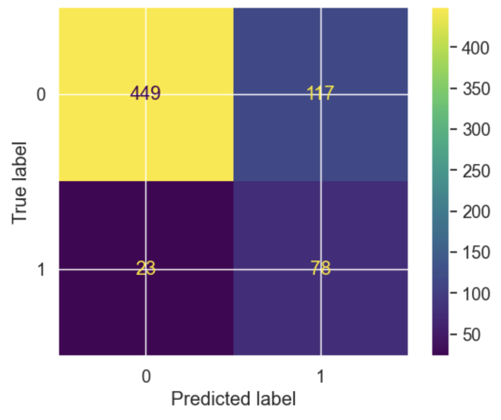

# Predicting customer churn for SyriaTel

This project predicts customer churn in a telecommunication company using machine learning tools to analyze historical data on customer behavior, service usage, and location factors.  

The goal is to identify patterns that signal when a customer is likely to cancel their service. By leveraging predictive models such as logistic regression or decision trees, the company can proactively intervene with targeted offers or improved services to retain at-risk customers.  

This project will utilize a dataset of SyriaTel customer interactions and subscription details, applying data preprocessing, feature engineering, and model evaluation to develop an accurate churn prediction model. This approach not only enhances customer satisfaction and loyalty but also significantly reduces loss in revenue.  

## Business understanding

Preventing customer churn is crucial for telecommunications companies due to its direct impact on profitability. High churn rates reflect customer dissatisfaction, which not only results in lost revenue but also increases the cost associated with acquiring new customers. Getting a new customer can cost five to twenty-five times more than keeping an existing customer.  

Studies have shown that even a small reduction in churn can significantly boost the company's revenue. For example, a 5% reduction in churn can increase profits by 25% to 95% depending on the industry context. This substantial effect arises because retained customers are likely to buy more over time and often cost less to serve due to their familiarity with the service and products.  

Additionally, predictive analytics in churn prevention allows telecom companies to identify at-risk customers early on, enabling them to take targeted actions to retain these customers. This proactive approach not only saves money but also improves customer satisfaction and loyalty by addressing their concerns before they lead to defection.  

## Stakeholder

Syriatel is a telecommunications provider, offering mobile services like domestic and international voice calls, SMS and voice mail to millions of subscribers. The company employs approximately 3,500 employees and serves 8 million customers as of 2016. It is headquartered on Sehnaya Road in Damascus according to [Wikipedia](https://en.wikipedia.org/wiki/Syriatel)

As the main stakeholder, the company will benefit from this analysis by reducing customer churn rates, potentially increasing revenues and profits, promoting growth, and enhancing its market position. Improved customer service will also benefit customer satisfaction rates. As the company grows in revenue, profits, customer base, and market share, shareholders will see greater returns on their investments.

### **Potential Business Questions:** 
* What were the factors influencing customer churn?
* Which services have the highest impact on customer churn?
* What services do customers with longer tenure have?
* What percentage of customers leave after one month/6 months/1 year?
* Which state has the highest churn rate?
* What is the best model for predicting customer churn?

### **Objectives:**
* identify the key features that determine if a customer is likely to churn
* determine the most suitable model to predict customer churn
* give customer retention recommendations to reduce churn

## Data

We used [Churn in Telecom's dataset](https://www.kaggle.com/datasets/becksddf/churn-in-telecoms-dataset). The dataset contains 3333 rows and 21 columns, giving details on customers' state, account length, area code, phone number, plans, and statistics on service usage such as calls, minutes, and charges across different times of the day, international usage, and customer service interactions, along with churn status.

## Target variable - Churn (0 or 1)

Our target valiable is churn, which reflects if a customer terminated contract(1) or did not(0). Target variable is imbalanced, about 15% is class 1 and 85% is class 0. We used SMOTE techniques to balance the data.  

* True Negatives (TN): Correct non-churn predictions.  
* False Positives (FP): Non-churn instances incorrectly predicted as churn.  
* False Negatives (FN): Churn instances incorrectly predicted as non-churn.  
* True Positives (TP): Correct churn predictions.  

## EDA

In the process of EDA we explored all features, their distributions and their relationship. 

For example we were able to distinguish high risk states - the highest churn rates per state.

## Models

We used three models - Logistic regression, Decision tree and Random Forest. After comparing perfomance of all three models, we came to a conclusion that with the selected data set the model for prediciting customer churn would be logistic regression.  

**Main metric** for evaluation we used is Recall. It measures the proportion of actual positives (churning customers) correctly identified by the model. High recall is crucial in churn prediction because missing out on identifying a customer who might churn (a false negative) can be costlier than mistakenly identifying a non-churning customer as at risk (a false positive).

## Best Model Evaluation

**Model Accuracy:** The logistic regression model achieves an overall accuracy of 79%, indicating a strong ability to correctly predict both churn and non-churn instances.

**Precision and Recall:**
Non-Churn Predictions (Class 0):
* Precision: 81% (Proportion of correct non-churn predictions)
* Recall: 78% (Proportion of actual non-churn instances correctly predicted)

Churn Predictions (Class 1):
* Precision: 78% (Proportion of correct churn predictions)
* Recall: 81% (Proportion of actual churn instances correctly predicted)

**F1-Score:** Both classes have an F1-score of 0.79, demonstrating a balanced performance between precision and recall, crucial for maintaining model reliability in both identifying churn and retaining non-churn customers.

**ROC AUC Score:** The model has a ROC AUC score of 0.849, reflecting its excellent capability to distinguish between the churn and non-churn classes. A higher ROC AUC score indicates better model performance in terms of sensitivity (true positive rate) and specificity (true negative rate).

**Confusion Matrix Analysis:**
True Negatives (TN): 455 - Correct non-churn predictions.
False Positives (FP): 130 - Non-churn instances incorrectly predicted as churn.
False Negatives (FN): 107 - Churn instances incorrectly predicted as non-churn.
True Positives (TP): 448 - Correct churn predictions.
This comprehensive analysis demonstrates that the model effectively completes classification tasks, making it an invaluable asset for pinpointing potential churn customers and facilitating targeted retention strategies.

Most important features for the model:

## Business Conclusions and Recommendations

Our analysis suggests that machine learning models can be used to accurately predict customer churn. We recommend using logistic regression as the main model for this prediction as it showed better performance in comparison to other models (desicion tree and random forest). Main advantages of logistic regression modeling are simplicity and easier interpretability. Introduing new features for analysis might require reevaluationg best model, as logistic regression shows better perfomance with limited number of features.

After a thorough analysis, finding the best predictive models and identyfing most importan features, we can propose following business resommendations to lower customer churn:

**1. Customer Service Calls**
Based on the analysis indicating that the number of customer service calls is correlated to higher churn rates. Customers who frequently call cutomer service are more likely to churn. There is no enough data to explore why those customers calls were made, what problems they were addressing and what were the outcomes - if their issues were solves or not. 
* We suggest collection and analysis of data on customer service calls (reason for call, type of issue, was the issue resolved, customer service experience satisfaction), so we can have a fuller picture of the existing correlation.

**2. International plan**

Customers with an active international plan are more likely to churn. After investigating, we found out that for a cost per international minute costs the same for people with international plan and without. This is our main assumption how international plan affects churn, other factors might include customers frequently travelling abroad and terminating contract every time, customers moving abroad. In general we advise to reassess and restructure the international plan offerings:  
* **Differentiate the international plan** by offering lower rates per minute or additional benefits such as free international texts or reduced rates for calls to popular destinations. This adds clear value compared to standard rates.
* **Gather feedback** from current international plan users to understand their pain points and expectations, which can help in designing a more attractive plan that addresses their needs. 
* Develop **tailored international plans** that benefit international callers, possibly with tiered pricing based on location to provide more flexibility and cost efficiency, e.g. 30 discounted minutes per month to a country of choice.

**3. Total minutes and total day minutes**

Customers with high total minutes and total day minutes are more likely to churn. Customers are charged per time they spend on a call, it's natural for customer to constantly try to reduce their spending. During our analysis we found out that day minutes cost more, compared to other times: day: 0.17, evening: 0.085, night: 0.045, international: 0.27.
Given that daytime minutes are more expensive and affect churn, we suggest the following recommendations to address potential churn related to this pricing structure:
* Evaluate the feasibility of **reducing the rates for daytime minutes**. This could mitigate the financial burden on customers who primarily use their phones during the day, leading to lower churn rates.
* Introduce more **flexible pricing plans** that allow customers to choose or customize their peak hours according to their usage patterns. This personalization can enhance customer satisfaction and loyalty.

**4. Location**

After analysing churn rates by state we indentified states with very high churn rate. There is no enough data to assume reasons and factors that affect churn rate by location. In this case our recommendations are:
* **Churn rate reasons by state analysis:** Collect additional data (feedback from customers) on reasons for churn distinguished by states.

## Data Limitations
* Data set might be outdated and needs updating
* The dataset lacks qualitative insights, such as customer satisfaction levels or reasons for customer service calls, which could provide deeper context for churn reasons.  

## Next Steps
* Introduce new features for analysis, including data usage and data services
* Include qualitative analysis for a deeper dive into customer feedback
* Invest into feedback collection and analysis from customers who churned

#### Authors: Dolgor Purbueva, Emma Scotson
